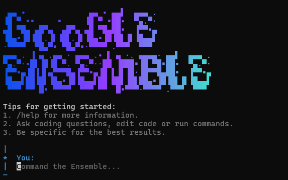

# Google Ensemble

An autonomous multi-agent IDE powered by Google. Four specialized AI agents collaborate to plan, code, design, and review your projects — all running locally on your machine.



## Tips for getting started:
1. `/help` for more information.
2. Ask coding questions, edit code or run commands.
3. Be specific for the best results.

## How It Works

Google Ensemble uses a **council of AI agents**, each with a distinct role:

| Agent | Role | Model | What it does |
|-------|------|-------|-------------|
| **Pro** | Orchestrator | Gemini 3 Pro | Plans tasks, coordinates agents, safety checks |
| **Jules** | Coder | Gemini 3 Pro(Jules) | Writes code, manages files, refactors |
| **Stitch** | Designer | Gemini 3 Flash(Stitch) | UI/UX design, React components, styling |
| **Flash** | Critic | Gemini 2.5 Pro | Reviews code, web research, security analysis |

The orchestrator analyzes your request, delegates tasks to the right agents, and synthesizes their outputs into a single response.

## Features

- **Web UI** — Next.js interface with real-time streaming responses and a file explorer
- **CLI** — Interactive terminal client with the full agent ensemble
- **Local Bridge** — Secure Express server for sandboxed file system operations and command execution
- **Multi-key support** — Separate API keys per agent for better rate limit management
- **Encrypted key storage** — AES-256-GCM encryption for API keys with password protection
- **Bridge security** — Token-based auth, localhost-only binding, command blocklist, rate limiting

## Quick Start

### 1. Clone & Install

```bash
git clone https://github.com/YOUR_USERNAME/google-ensemble.git
cd google-ensemble
npm install
```

### 2. Configure API Keys

```bash
cp .env.example .env
```

Edit `.env` and add your Google AI Studio keys. You can use a single key for all agents or separate keys:

```env
GOOGLE_API_KEY=AIzaSy...          # Fallback key (required)
LEADER_API_KEY=AIzaSy...          # Optional: dedicated key for Pro
CODER_API_KEY=AIzaSy...           # Optional: dedicated key for Jules
DESIGNER_API_KEY=AIzaSy...        # Optional: dedicated key for Stitch
CRITIC_API_KEY=AIzaSy...          # Optional: dedicated key for Flash
```

Get your keys from [Google AI Studio](https://aistudio.google.com/app/apikey).

### 3. Start

**Web UI:**
```bash
# Terminal 1: Start the bridge server
npm run bridge

# Terminal 2: Start the Next.js app
npm run dev
```
Open [http://localhost:3000](http://localhost:3000).

**CLI:**
```bash
# Interactive ensemble (recommended)
npm run loom

# Lightweight single-agent CLI
npm run cli
```

## Project Structure

```
google-ensemble/
├── app/                    # Next.js app (pages, API routes)
│   ├── api/council/        # Main AI endpoint
│   └── api/bridge-token/   # Bridge auth token endpoint
├── cli/                    # Lightweight CLI client
├── components/             # React components (Console, FileTree, Onboarding)
├── lib/
│   ├── agents/             # Agent definitions, factory, prompts
│   ├── auth/               # Vault (key management, encryption at rest)
│   ├── crypto/             # AES-256-GCM encryption (Node.js + browser)
│   ├── tools/              # Tool definitions (Zod schemas)
│   └── executor.ts         # Bridge client (executes tools)
├── local-bridge/           # Express server for FS + command execution
├── src/                    # CLI ensemble (orchestrator, setup, doctor)
├── .env.example            # Configuration template
└── package.json
```

## Security

Google Ensemble is designed to run **locally on your machine**. It is not a hosted service.

### Bridge Server
- Binds to `127.0.0.1` only (not accessible from the network)
- Token-based authentication (random token generated at each startup)
- Sandboxed file access (cannot escape project root)
- Command blocklist (blocks reverse shells, network exfiltration, privilege escalation)
- Rate limiting (120 req/min)
- 10MB body size limit

### API Key Encryption
Keys can be encrypted at rest using AES-256-GCM with a user-chosen password:
- PBKDF2 key derivation (100k iterations, SHA-512)
- Random salt and IV per encryption
- Keys stored as `ENC:salt:iv:tag:ciphertext` in `.env`
- Decrypted in memory only at startup

## Optional: Web Search

To enable the `search_web` tool, add these to your `.env`:

```env
GOOGLE_SEARCH_API_KEY=...         # From https://developers.google.com/custom-search/v1/overview
GOOGLE_SEARCH_ENGINE_ID=...       # From https://programmablesearchengine.google.com/
```

## Tech Stack

- **Framework:** Next.js 16, React 19, TypeScript
- **AI:** Google Gemini (via AI SDK + @google/generative-ai)
- **Styling:** Tailwind CSS
- **CLI:** @clack/prompts, picocolors
- **Bridge:** Express 5
- **Validation:** Zod 4

## License

ISC
